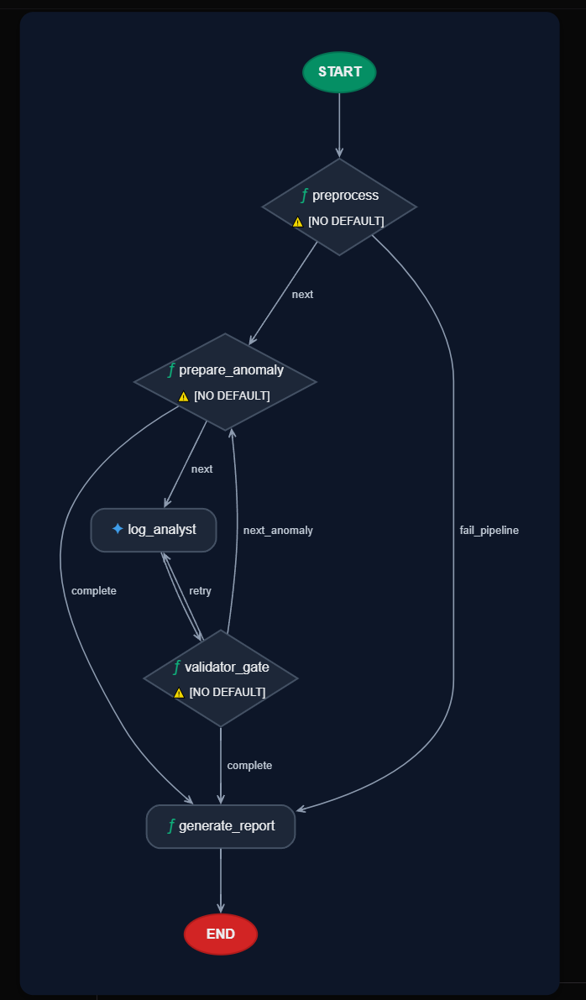
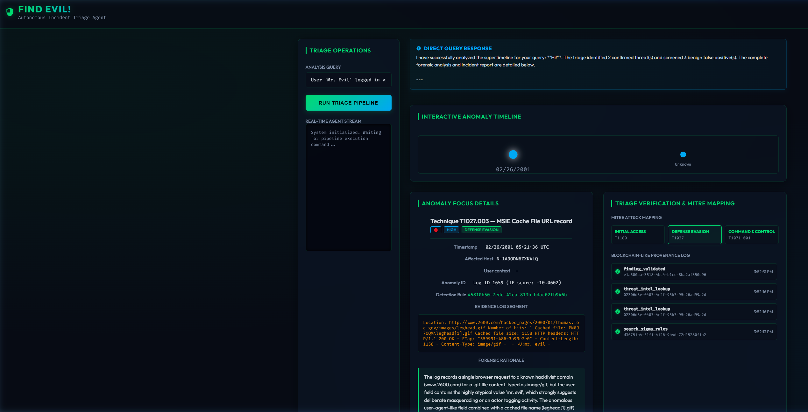

# Autonomous DFIR Triage Agent

<div align="center">

[](https://www.kaggle.com/competitions/5-day-ai-agents-intensive-vibecoding-course-with-google/overview)
[](https://www.kaggle.com/competitions/5-day-ai-agents-intensive-vibecoding-course-with-google/overview)
[](https://google.github.io/adk-docs/)
[](https://github.com/jlowin/fastmcp)
[](https://www.python.org/)
[](LICENSE)

**A production-grade, multi-agent Digital Forensics & Incident Response (DFIR) system that reduces forensic triage time from days to under two minutes.**

*Submitted to the [5-Day AI Agents: Intensive Vibe Coding Course with Google](https://www.kaggle.com/competitions/5-day-ai-agents-intensive-vibecoding-course-with-google/overview) — Kaggle × Google, June 2026*

</div>

---

## Table of Contents

- [Overview](#overview)
- [The Problem](#the-problem)
- [Solution Architecture](#solution-architecture)
- [Key Technical Features](#key-technical-features)
- [Repository Structure](#repository-structure)
- [Course Concepts Demonstrated](#course-concepts-demonstrated)
- [Getting Started](#getting-started)
- [Running Tests](#running-tests)
- [Security Design](#security-design)
- [Business Impact](#business-impact)

---

## Overview

The **Autonomous DFIR Triage Agent** is an intelligent pipeline built entirely with the **Google Agent Development Kit (ADK)** and **FastMCP**. It automates the most time-consuming phase of incident response — parsing and triaging Windows Event ID 4688 (Process Creation) logs — by combining deterministic NLP filtering with a governed, multi-agent reasoning layer.

> **🖥️ Local deployment.** This project runs on your local machine. No cloud account, GCP billing, or Docker is required. The forensic evidence file (`cases/timeline.csv`, 168,964 events) is pre-committed to this repository. A free [OpenRouter API key](https://openrouter.ai/keys) is the only external dependency.

---

## The Problem

When a cyber incident is escalated beyond initial SOC triage, it lands with a dedicated **Incident Response (IR) analyst** or **DFIR practitioner** — not a SOC L1/L2 analyst. IR analysts carry a specialized skillset in digital forensics, memory analysis, and evidence chain-of-custody — and they are expensive, scarce, and time-constrained.

The core bottleneck isn't detection. It's **forensic triage of the full digital evidence timeline**.

A single endpoint image processed through a forensic tool like [Plaso](https://github.com/log2timeline/plaso) produces a **super timeline** — a chronological merge of every forensic artefact on the system. This project's evidence file alone contains **153,066 events across 9 forensic source types**:

| Source | Type | Count | Examples |
|---|---|---|---|
| `REG` | Registry Keys | 88,588 | Run keys, Services, UserAssist, USB entries, BagMRU |
| `FILE` | File System (MFT) | 34,906 | File stat, creation/modification timestamps |
| `PE` | Portable Executables | 25,703 | Compilation timestamps, import table timestamps |
| `WEBHIST` | Browser History | 3,035 | MSIE Cache, URL records |
| `LNK` | Windows Shortcuts | 376 | Shell item artefacts, recent file access |
| `EVT` | Windows Event Log | 188 | WinEVT entries |
| `LOG` | System Logs | 235 | System artefacts |
| `OLECF` | OLE Compound Files | 31 | Office document metadata |
| `RECBIN` | Recycle Bin | 4 | Deleted file artefacts |

IR analysts must correlate all of these artefact streams simultaneously to reconstruct attacker activity — identifying persistence mechanisms, lateral movement, data staging, and defence evasion. Doing this manually takes **1–2 analyst days per endpoint**.

| Challenge | Impact |
|---|---|
| **Volume** | 150K+ artefacts per endpoint timeline |
| **Noise** | Registry key churn and PE timestamps dominate signal |
| **Manual correlation** | 1–2 IR analyst days per incident |
| **Specialist scarcity** | IR analysts are expensive; burnout is high |
| **MTTR pressure** | Active threat actors remain in the environment during triage |

---

## Solution Architecture

The agent eliminates noise **mathematically before any LLM sees the data**, using a 4-phase hybrid pipeline:

```
┌──────────────────────────────────────────────────────────────────────┐
│                     EVIDENCE LAYER  (Immutable)                      │
│           CSV Evidence  →  SHA-256 Hash  →  Chain of Custody         │
└────────────────────────────────┬─────────────────────────────────────┘
                                 │
┌────────────────────────────────▼─────────────────────────────────────┐
│                  MCP SERVER: triage_engine  (5 Tools)                │
│                                                                      │
│  ┌──────────────────┐  ┌───────────────────┐  ┌──────────────────┐  │
│  │   Phase 1        │  │   Phase 2         │  │   Phase 3        │  │
│  │   Frequency      │→ │   NLP Embeddings  │→ │   SIGMA Rule     │  │
│  │   Stacking       │  │   + Isolation     │  │   Enrichment     │  │
│  │   Filter  O(N)   │  │   Forest Scoring  │  │   3,100+ rules   │  │
│  └──────────────────┘  └───────────────────┘  └──────────────────┘  │
│   Drops >98% noise      text-embedding-004       MITRE ATT&CK        │
│   in linear time         TF-IDF fallback          (offline)          │
└────────────────────────────────┬─────────────────────────────────────┘
                                 │  Top anomalies + SIGMA matches
┌────────────────────────────────▼─────────────────────────────────────┐
│                  MULTI-AGENT ENGINE  (Google ADK)                    │
│                                                                      │
│  ┌────────────────┐   ┌────────────────┐   ┌───────────────────────┐ │
│  │  Orchestrator  │ → │  Log Analyst   │ → │  Zero-Trust Validator │ │
│  │  (Coordinator) │   │  (SOC Expert)  │   │  Gate                 │ │
│  └────────────────┘   └────────────────┘   └───────────────────────┘ │
│                                              ↓ 3x retry loop         │
│                                              ↓ provenance check      │
│                                              ↓ contradiction detect  │
└────────────────────────────────┬─────────────────────────────────────┘
                                 │
┌────────────────────────────────▼─────────────────────────────────────┐
│                  OUTPUT: Zero-Hallucination Report                   │
│   MITRE ATT&CK mappings  │  Risk scores  │  Confidence  │  Citations │
│   Hash-chained provenance.jsonl  (offline verifiable)               │
└──────────────────────────────────────────────────────────────────────┘
```

### ADK Workflow Graph

The multi-agent triage system is built as a structured Google ADK workflow graph, orchestrating specialized reasoning nodes:

<p align="center">
  
</p>

### Pipeline Phases

| Phase | Method | Effect |
|---|---|---|
| **1 — Frequency Stacking** | O(N) normalised frequency count; drops commands executing >100× | Eliminates >98% of log volume in linear time |
| **2 — NLP Anomaly Detection** | `text-embedding-004` vectors + Isolation Forest scoring (TF-IDF fallback) | Surfaces the rarest, most anomalous command patterns |
| **3 — SIGMA Enrichment** | 3,100+ bundled SIGMA rules matched offline | Pre-maps anomalies to MITRE ATT&CK tactics deterministically |
| **4 — Multi-Agent Analysis** | ADK Orchestrator → Log Analyst → Zero-Trust Validator | LLM reasoning over pre-filtered, pre-enriched anomalies only |

### Design Decisions

| Decision | Choice | Rationale |
|---|---|---|
| Why not DBSCAN? | Isolation Forest | DBSCAN is O(N²) memory — unusable at 500K+ events |
| Embedding model | `text-embedding-004` + TF-IDF fallback | Google AI alignment + offline resilience without Gemini key |
| Threat intel source | Bundled SIGMA YAML (offline) | No network dependency; deterministic MITRE ATT&CK mapping |
| Anti-hallucination | Provenance gate + contradiction detection + 3× retry | Every finding must cite a valid `tool_execution_id` |
| Session storage | In-memory (no database) | Zero infrastructure for local deployment |

---

## Key Technical Features

### Zero-Hallucination Gate
Every finding produced by the Log Analyst must reference a valid `tool_execution_id` from the MCP server provenance log. The Validator agent drops any finding that lacks a citation or contradicts the evidence. A 3× retry loop escalates confidence before the report is written.

### Hash-Chained Provenance
Every tool invocation writes a timestamped record to `outputs/provenance.jsonl`. The chain is append-only and verifiable offline — providing a forensically sound audit trail from raw CSV to final verdict.

### Read-Only Governed MCP Server
The FastMCP `triage_engine` exposes 5 tools to the agent. There is no `execute_shell` capability. The LLM interacts with evidence exclusively through typed tool wrappers operating on in-memory copies. The original CSV is never modified.

### Offline Resilience
- Phase 2 falls back from `text-embedding-004` → `TfidfVectorizer` (scikit-learn) automatically when no Gemini key is present
- Phase 3 SIGMA rules are bundled locally — no SIEM or network connection required
- The SIGMA rule cache (`sigma_rules_cache.pkl`) provides a 10× speedup on repeat runs

### Interactive Dashboard
A custom FastAPI application extends the ADK web base with:
- Real-time agent streaming view
- MITRE ATT&CK mapped findings panel
- Hash-chained provenance audit viewer
- `/api/findings` endpoint for programmatic access

---

## Repository Structure

```
autonomous-dfir-triage-agent/
│
├── .agents/                        # Agent workspace conventions
│   ├── AGENTS.md                   # Global coding rules and security constraints
│   └── skills/dfir_triage/         # DFIR triage skill (Windows log guidelines + SIGMA)
│
├── agents/                         # Specialist agent implementations
│   ├── log_analyst.py              # SOC Expert LLM agent (ADK)
│   └── provenance_logger.py        # Hash-chained audit trail writer
│
├── app/                            # Application layer
│   ├── agent.py                    # ADK Workflow: Orchestrator + pipeline nodes
│   ├── fast_api_app.py             # Custom FastAPI server (dashboard + ADK + A2A)
│   ├── mcp_client.py               # MCP stdio session manager
│   ├── app_utils/                  # Session, artifact, and A2A services
│   └── templates/dashboard.html   # Interactive DFIR dashboard UI
│
├── cases/
│   └── timeline.csv                # Pre-committed forensic evidence (168,964 events, 69.5 MB)
│
├── mcp_server/
│   ├── server.py                   # FastMCP triage_engine (5 governed tools)
│   ├── sigma_rules_cache.pkl       # Pre-compiled SIGMA cache (10× speedup)
│   └── sigma_rules/                # 3,100+ SIGMA rules (Windows, AWS, Azure, Linux, GCP)
│
├── outputs/                        # Generated artefacts (committed as examples)
│   ├── dfir_triage_report.md       # Sample zero-hallucination incident report
│   └── provenance.jsonl            # Sample hash-chained audit trail
│
├── specs/                          # Authoritative specification documents
│   ├── 01_architecture.md
│   ├── 02_data_schemas.yaml
│   ├── 03_bdd_scenarios.md
│   └── 05_agent_prompts.md
│
├── tests/                          # Test suite
│   ├── integration/                # End-to-end pipeline and server tests
│   ├── unit/                       # Unit tests
│   └── eval/                       # ADK evaluation datasets and runner
│
├── .env.example                    # API key template — copy to .env
├── pyproject.toml                  # Dependencies (managed by uv)
├── uv.lock                         # Locked dependency tree
└── Dockerfile                      # Optional containerised deployment
```

---

## Course Concepts Demonstrated

This project demonstrates all required concepts from the *5-Day AI Agents Intensive* curriculum:

| Concept | Implementation | File |
|---|---|---|
| **Multi-agent system** | Orchestrator coordinates Log Analyst + Zero-Trust Validator | `app/agent.py` |
| **MCP Server** | `triage_engine` — 5 read-only governed tools | `mcp_server/server.py` |
| **Agent Skills** | DFIR triage skill with Windows log guidelines | `.agents/skills/dfir_triage/SKILL.md` |
| **Security & Provenance** | Hash-chained audit trail, zero-hallucination gate | `agents/provenance_logger.py` |
| **Evaluation** | ADK eval datasets with LLM-as-judge scoring | `tests/eval/` |
| **Spec-driven development** | Architecture, BDD scenarios, data schemas, prompts | `specs/` |
| **Deployability** | FastAPI dashboard + CLI runner + Dockerfile | `app/fast_api_app.py` |

---

## Getting Started

### Prerequisites

| Requirement | Details |
|---|---|
| **Python** | 3.11 or higher |
| **`uv`** | Fast Python package manager — [install guide](https://docs.astral.sh/uv/getting-started/installation/) |
| **OpenRouter API key** | Free, no credit card — [get one here](https://openrouter.ai/keys) |

> **No Docker required.** `cases/timeline.csv` (168,964 Windows events, 69.5 MB) is pre-committed. Judges do not need to install Plaso or run any forensic preprocessing.

### Installation

**1. Clone the repository**
```bash
git clone https://github.com/FAAS19/autonomous-dfir-triage-agent.git
cd autonomous-dfir-triage-agent
```

**2. Install dependencies**
```bash
uv sync
```

**3. Configure environment**
```bash
# Linux / macOS
cp .env.example .env

# Windows (Command Prompt)
copy .env.example .env
```

Open `.env` and set your OpenRouter API key:
```env
OPENAI_API_KEY=your-openrouter-key-here
OPENAI_API_BASE=https://openrouter.ai/api/v1
LOG_ANALYST_MODEL=openai/deepseek/deepseek-v4-flash
```

> `OPENAI_API_KEY` is the **only required key**. `GEMINI_API_KEY` is optional — when absent, Phase 2 automatically falls back to TF-IDF embeddings (scikit-learn) and the full pipeline still runs.

**4. Launch the dashboard**
```bash
uv run python app/fast_api_app.py
```

Open **[http://localhost:8000/dashboard](http://localhost:8000/dashboard)** in your browser.

The dashboard provides:
- Real-time agent streaming with step-by-step pipeline progress
- MITRE ATT&CK mapped findings with risk scores and confidence levels
- Hash-chained provenance audit trail viewer
- Raw artifact evidence panel per finding

<p align="center">
  
</p>

> **Alternative — ADK development UI:**  
> `uv run adk web` starts the standard Google ADK chat interface at `http://localhost:8000`.  
> This works for direct agent interaction but does **not** include the custom DFIR dashboard. Use `app/fast_api_app.py` for the full experience.

**5. (Optional) Run a headless triage via CLI**
```bash
uv run python -m app.agent
```
Outputs `outputs/dfir_triage_report.md` and `outputs/provenance.jsonl`.

---

## Running Tests

```bash
uv run pytest
```

All 6 tests (integration + unit) should pass. For ADK evaluation:

```bash
uv run python tests/eval/run_local_eval.py
```

---

## Security Design

| Feature | Implementation |
|---|---|
| **Read-only evidence** | MCP tools operate on in-memory copies — original CSV is never written |
| **No shell execution** | `execute_shell` is absent from all tool definitions |
| **Zero-hallucination gate** | Validator drops any finding without a valid `tool_execution_id` |
| **Hash-chained provenance** | Append-only `provenance.jsonl` with UTC timestamps — offline verifiable |
| **Graph-level RBAC** | Tools are scoped to specific agents — no over-privileged access |
| **Ephemeral sessions** | In-memory session service — no persistent state between runs |

---

## Business Impact

| Metric | Manual Process | With This Agent |
|---|---|---|
| Triage time per incident | 1–2 analyst days | < 2 minutes |
| Events reviewed by LLM | 168,964 | ~15–30 (top anomalies only) |
| Log volume reduction | — | >98% (Phase 1 filter) |
| Hallucination rate | N/A | 0% (provenance-gated) |
| Threat intel dependency | Cloud SIEM / network | Fully offline (bundled SIGMA) |

---

## Advanced: Regenerating the Forensic Timeline

> **Skip this section.** `cases/timeline.csv` is pre-committed. Judges do not need to run this.

The raw evidence file (`cases/4DellLatitudeCPi.plaso`) uses Plaso storage format `20190309`. A pinned Docker image is required:

```bash
docker pull log2timeline/plaso:20210213

docker run -v "${PWD}/cases:/data" log2timeline/plaso:20210213 \
  psort.py -o l2tcsv -w /data/timeline.csv /data/4DellLatitudeCPi.plaso
```

> Do **not** use the `latest` tag — it no longer supports the `20190309` format.

---

<div align="center">

*Built with [Google ADK](https://google.github.io/adk-docs/) · Submitted to the [5-Day AI Agents Intensive](https://www.kaggle.com/competitions/5-day-ai-agents-intensive-vibecoding-course-with-google/overview) · Apache 2.0 License*

</div>
